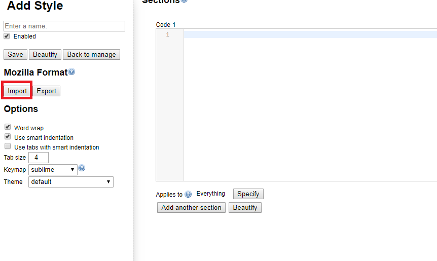
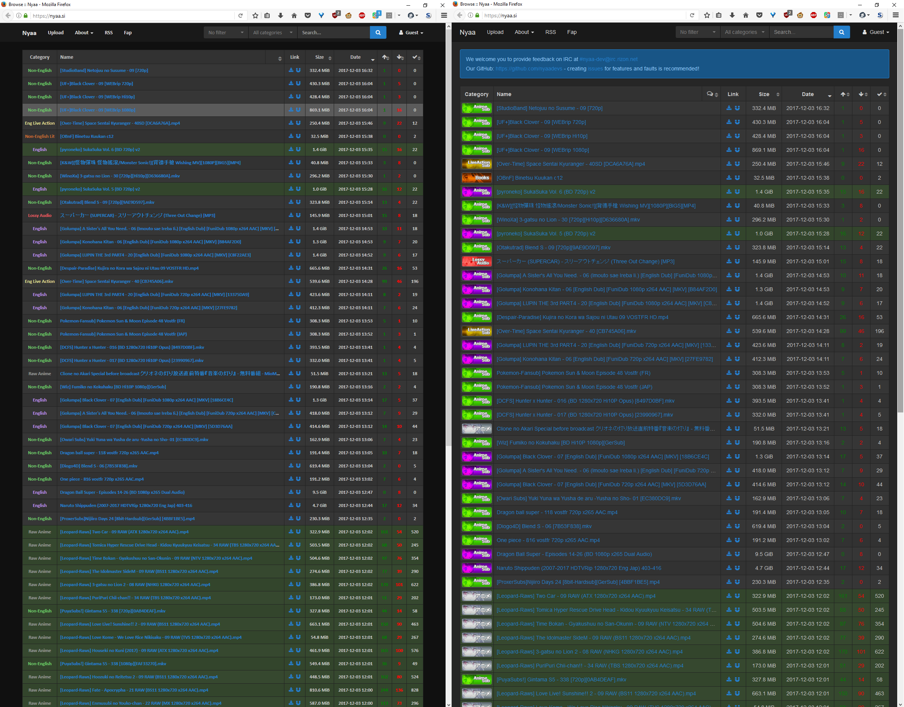
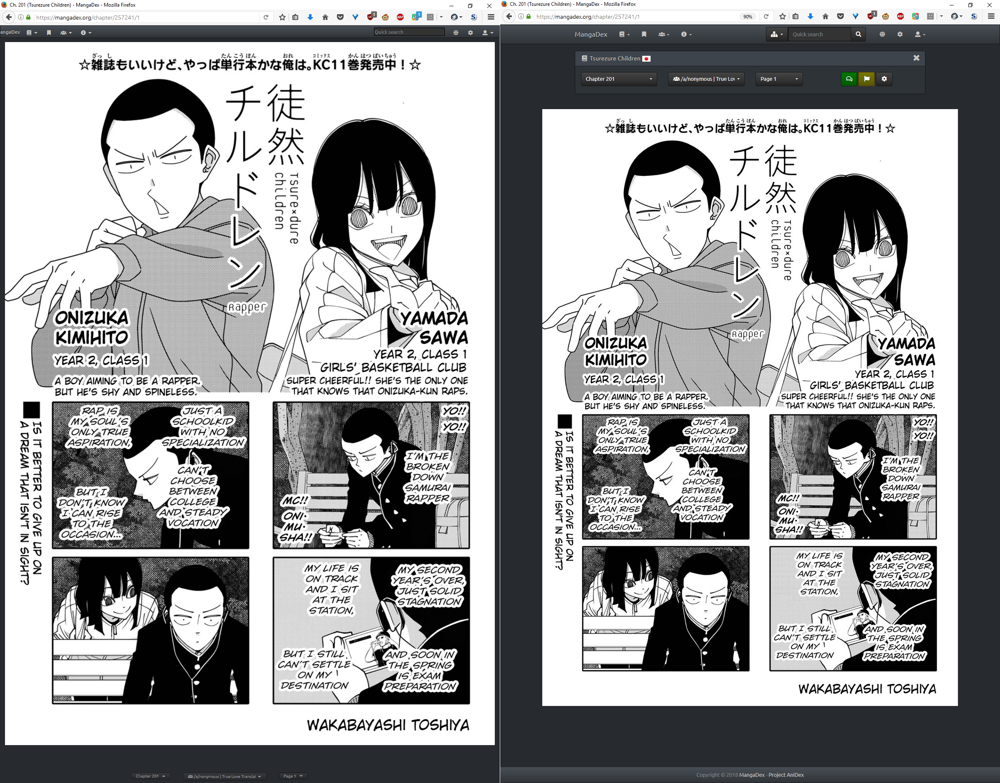
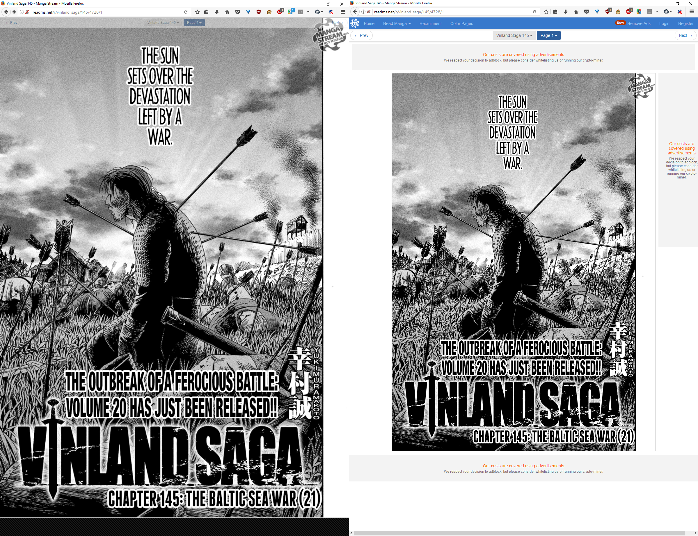
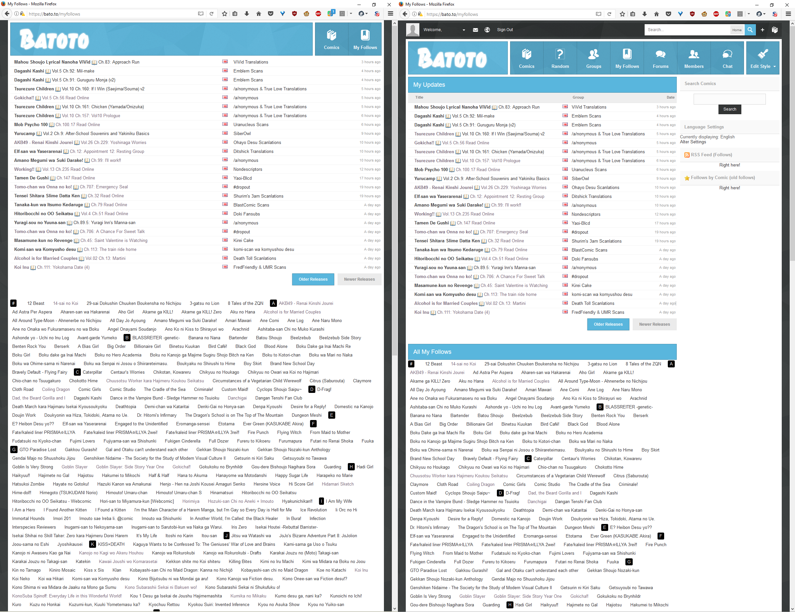
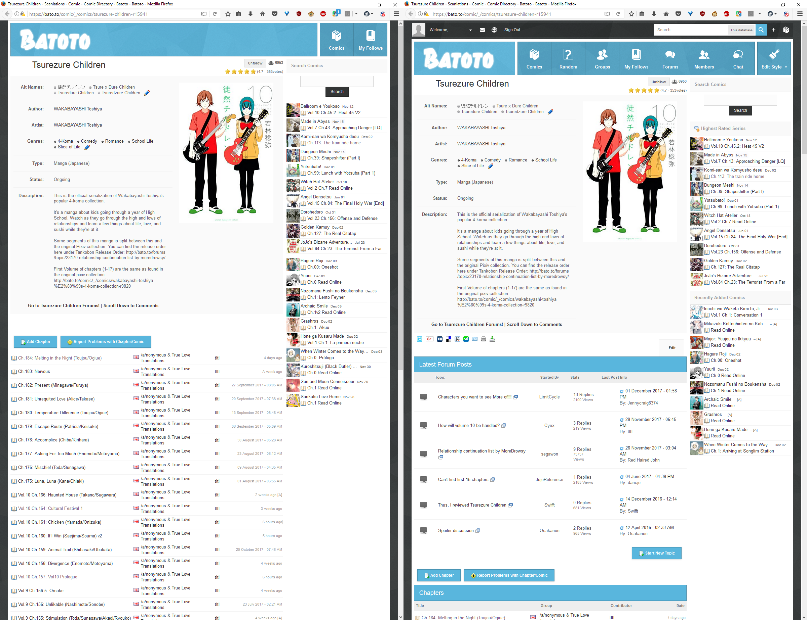
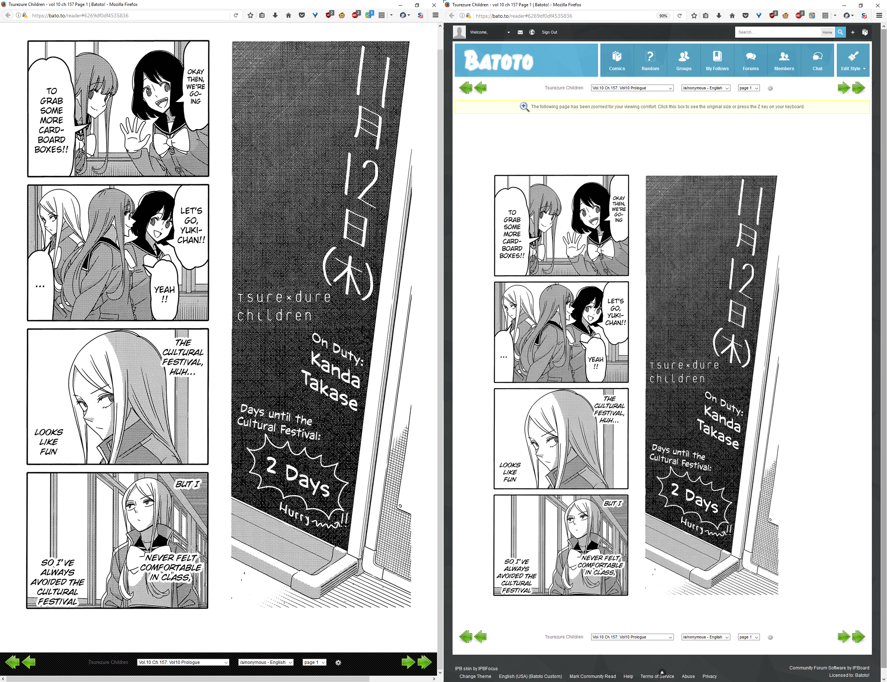

# Stylish scripts for Firefox
Most of these are made because I was tired of looking at dead space and useless information.
You will need to download the stylish addon for [Firefox](https://addons.mozilla.org/en-US/firefox/addon/stylish/) or [Chrome](https://chrome.google.com/webstore/detail/stylish-custom-themes-for/fjnbnpbmkenffdnngjfgmeleoegfcffe?hl=en)
* All of these are aimed for use on a portrait/vertical oriented monitor
* These can still work for Chrome, just have to import via Firefox style.

## Dark Minimal Nyaa ##
Used for nyaa.si dark theme.
* Remove banner
* Replaces icons with text
* More compact

## Minimal Mangadex Reader ##
* Remove everything but the image and enlarge image to fit width of window
* Site navigation bar remains at top, made things smaller and got rid of some elements
* Manga navigation at bottom, has transparency until hovered

## Minimal Mangastream Reader ##
* Remove everything but the image and enlarge image to fit width of window
* Navigation bar remains at top, but has transparency
Sadly can't get rid of the watermark

# Below is kill #
## Minimal Batoto ##
Contains both portions of Minimal Batoto Follow and Minimal Batoto Reader found below in one stylish script.
If you only want the reader portion in order to access forum and other social pages, consider only installing Reader.
[Download from userstyles.org](https://userstyles.org/styles/152367/minimal-batoto-portrait)

## Minimal Batoto Follow ##
* Removes account bar at top
* Removes unnecessary tabs at the top (mostly social features)

### Follow page ###
* Removes right-hand column search/RSS/language settings
* Removes section title bars and tables

### Series page ###
* Remove social links
* Remove forum section
* Removes section titles

## Minimal Batoto Reader ##
* Remove everything but the image and enlarge image to fit width of window
* Navigation remains at bottom of screen (useful for returning to series page or goto chapter)

